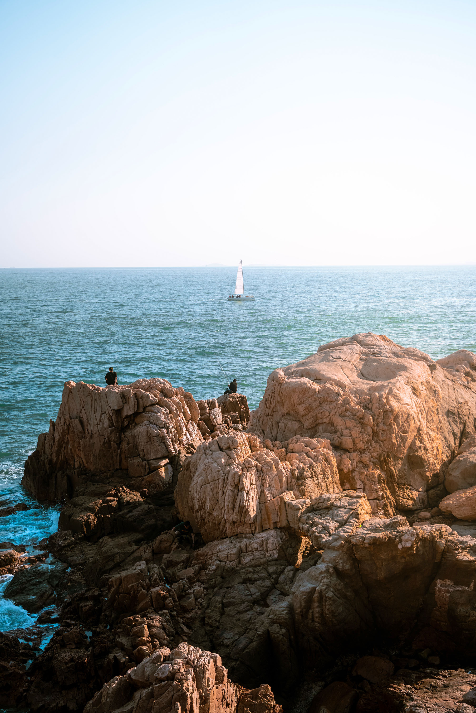

# these are my works which i painted them with turtle library :

- this is my tree code

<pre style="font-size:25;">
import turtle as t

def gol():
    for _ in range(6):
        for i in range(2):
            t.fillcolor("pink")
            t.begin_fill()
            t.pencolor("pink")
            t.circle(5,90)
            t.lt(90)
            t.end_fill()
        t.rt(60)

def tree(d,r,w):
    t.pencolor("darkorange4")
    if d<10 or r<10:
        return
    t.pensize(w)
    t.fd(d)
    t.lt(r)
    tree(d*0.7,r,w*0.5)
    t.rt(2*r)
    if d>=10 and d<15 :
        gol()
    tree(d*0.7,r,w*0.5)
    t.lt(r)
    t.backward(d)

t.speed(0)
t.lt(90)
tree(100 ,30,20)
t.mainloop()
</pre>
اول یک تابع برای  گل درخت ام تعریف کردم که از دایره براش استفاده کردم 
سپس درختم را طوری که اندازه شاخه هایش رو به بالا نازک شود تعریف کردم و رنگ هم براش مشخص کردیم 

- this is my jungle code
<pre style="font-size:25;">
import turtle as t
import random

color_list=["pink","#f0979e","#e3919f"]

def gol():
    x = random.choice(color_list)
    for _ in range(6) :
        for i in range(2):
            t.fillcolor (x)
            t.begin_fill()
            t.pencolor(x)
            t.circle(5,90)
            t.lt(90)
            t.end_fill()
        t.rt(60)

t.bgcolor("#99d6f0")
def zamin():
    t.setpos(random.randint(-1800,1800))
    t.rt(90)
    t.fd(1800)
    t.rt(90)
    t.fd(1000)
    t.rt(1800)
    t.fd(1000)

def tree(d,r,w):
    t.pencolor("darkorange4")
    if d<10 or r<10:
        return
    t.pensize(w)
    t.fd(d)
    t.lt(r)
    tree(d*random.randint(5, 8)*0.1,r,w*0.5)
    t.rt(2*r)
    if d>=10 and d<15 :
        gol()
    tree(d*random.randint(5, 8)*0.1,r,w*0.5)
    t.lt(r)
    t.backward(d)

def jangal(d,r,w):
    for _ in range(0,20): 
        t.penup()
        t.setpos(random.randint(-500,500), random.randint(-300, -100))
        t.pendown()
        tree(d,r,w)

t.tracer(0)
t.penup()
t.setpos(-1800, -50)
t.pencolor("#49b51f")
t.fillcolor("#49b51f")
t.pendown()
t.begin_fill()
t.fd(3600)
t.rt(90)
t.fd(1000)
t.rt(90)
t.fd(3600)
t.rt(90)
t.fd(1000)
t.end_fill()

for _ in range(10):
    t.penup()
    t.setpos(random.randint(-800,600), random.randint(150,350))
    t.pendown()
    gol()

jangal(100, 30, 10)
t.update()
t.mainloop()
</pre>
برای جنگلم از تابع درختم که در بالا نوشته بودم استفاده کردم و از رندوم برای اینکه بیشتر شبیه جنگل شود استفاده کردم و برای رنگ صفحه که شبیه آسمان شود آبی انتخاب کردم و یک مستطیل برای زمین به رنگ سبز تعریف کردم
- this is my triangle fractal code

<pre style="font-size:25;">
import turtle as t
def triangle(d):
    if d<10:
        return
    t.pensize(3)
    t.pencolor("light pink")
    for i in range(3):
        t.tracer(0)
        t.fd(d)
        t.lt(120)
        triangle(d/2)
        t.update()

triangle(200)
t.mainloop()
</pre>
ابتدا برای مثلثم رنگ و سایز انتخاب کردم و برای مثلث توی رنج 3 تا وقتی طول مشخص شده رو داشته باشه مثلث بکشه با که مهم ترین نکته اینه که باید 120 درجه بچرخد اندازه زاویه خارجی مثلث

---
**Test**: 
